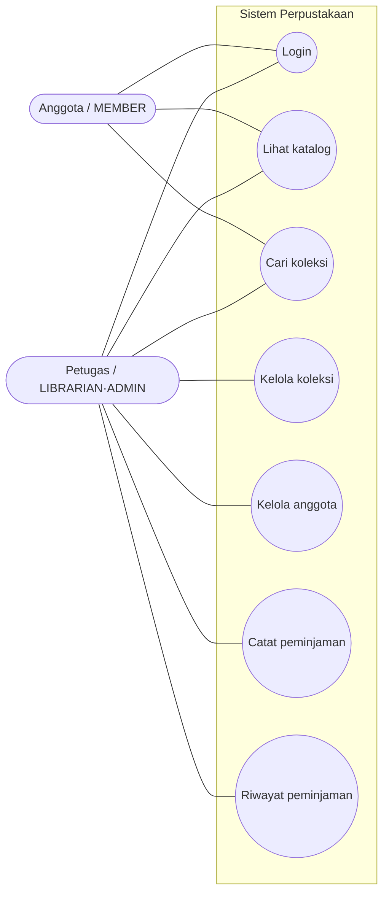
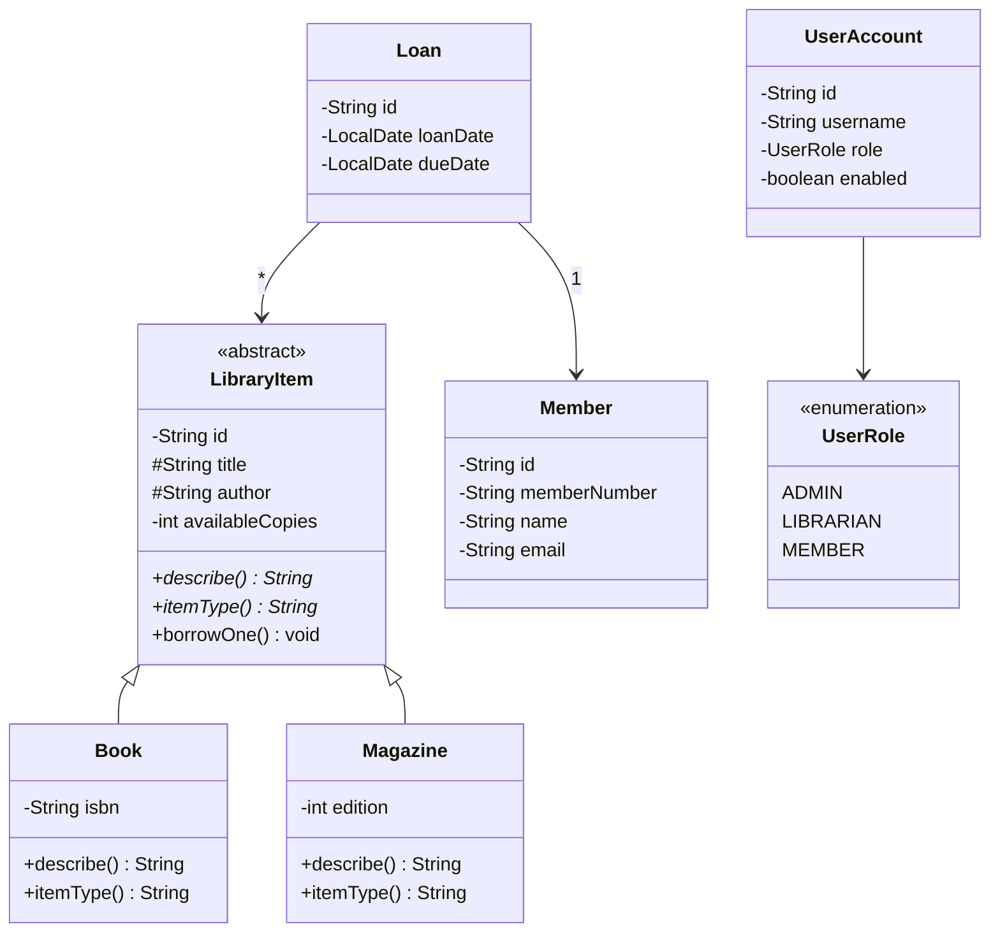
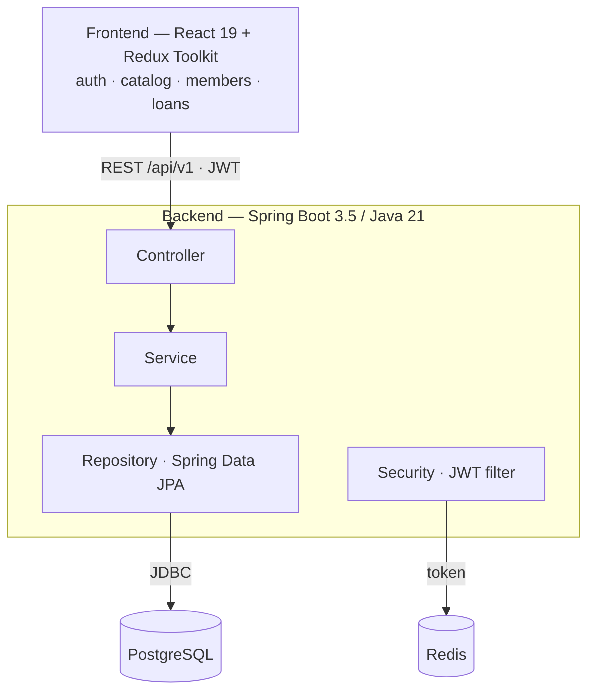

# Library — Aplikasi Perpustakaan

Monorepo aplikasi perpustakaan: **katalog koleksi** untuk anggota dan **pencatatan peminjaman**
oleh petugas. Dibangun ulang dan dimodernisasi dari project lama `warung-makan-bahari`
(frontend) dan `warung-makan-bahari-api` (backend).

Dokumen ini adalah **dokumen utama asesmen** (skema *Pemrogram / Programmer*, FR.IA.02): berisi
metode pengembangan, diagram, arsitektur, cara menjalankan, dan pengujian. Detail panjang
ditautkan ke folder [`docs/`](docs/).

```
library/
├── backend/     # Spring Boot 3.5 · Java 21 · Spring Security · JWT · PostgreSQL · Redis
├── frontend/    # React 19 · TypeScript · Vite 6 · Redux Toolkit · React Router 7 · Tailwind 4 + daisyUI
├── docs/        # dokumen perencanaan, pengujian, dan pemetaan kompetensi
└── docker-compose.yml
```

> **Catatan stack:** dokumen tugas menyebut Java + MySQL (desktop/mobile). Implementasi ini Java +
> **PostgreSQL/Redis** dengan antarmuka **web SPA**. Seluruh kompetensi (OOP, akses basis data,
> dokumentasi kode, uji unit) tetap terpenuhi pada stack ini.

---

## Daftar dokumen

| Dokumen | Isi |
| --- | --- |
| **README.md** (ini) | Ringkasan, metode, diagram, arsitektur, cara jalan, lisensi |
| [`docs/TESTING.md`](docs/TESTING.md) | Kebutuhan uji, **skenario + data uji**, prosedur, dan **hasil/evaluasi** |
| [`docs/COMPETENCY-MAPPING.md`](docs/COMPETENCY-MAPPING.md) | Pemetaan **35 langkah kerja FR.IA.02 → lokasi di kode** |

---

## 1. Metode pengembangan

**Incremental Development.** Fondasi aplikasi — autentikasi (JWT), arsitektur berlapis, dan
standar respons — dibangun lebih dulu dan teruji. Di atasnya ditambahkan *increment* fitur domain
(katalog, anggota, peminjaman). Tahapannya: **analisis kebutuhan → desain (UML) → implementasi
per-fitur → pengujian unit → integrasi.**

Alasan: kebutuhan jelas dan terbatas, durasi singkat (8 jam), serta sudah ada basis kode stabil —
sehingga incremental lebih efisien daripada Waterfall penuh dari nol. Setiap fitur dikerjakan
dengan **TDD** (tulis tes gagal → buat hijau → refactor).

---

## 2. Diagram

Nama kelas pada diagram memakai **Bahasa Inggris**, identik dengan kode (`LibraryItem`, `Book`,
`Magazine`, `Member`, `Loan`). Render diagram di [mermaid.live](https://mermaid.live) bila perlu PNG.

| Konsep (Indonesia) | Class (kode) |
| --- | --- |
| Koleksi (abstrak) | `LibraryItem` |
| Buku / Majalah | `Book` / `Magazine` |
| Anggota | `Member` |
| Peminjaman | `Loan` |

### a. Use Case Diagram



### b. Class Diagram

Menampilkan pewarisan `LibraryItem → Book/Magazine`, hak akses (`-` private, `#` protected,
`+` public), serta relasi domain. `UserAccount` (identitas login) sengaja **terpisah** dari
`Member` (data anggota) — pemisahan keamanan dan domain.



### c. Component Diagram



---

## 3. Penerapan model & IDE

Hasil pemodelan diterapkan ke **arsitektur berlapis (layered MVC)**:

`Controller (REST) → Service (interface + impl) → Repository (Spring Data JPA) → Entity → Database`

- *Class diagram* dipetakan langsung ke paket `entity/`, `repository/`, `service/`, `controller/`.
- *Component diagram* dipetakan ke pemisahan frontend (React/Vite) dan backend (Spring Boot) via REST.

**IDE:** **IntelliJ IDEA** untuk backend (dukungan penuh Spring Boot, Maven, debugger, Javadoc);
**VS Code** untuk frontend (TypeScript, Vite, ESLint).

---

## 4. Cara menjalankan

### Opsi A — Docker (semua sekaligus)

```bash
docker compose up --build
```

- Frontend → http://localhost:3000
- Backend  → http://localhost:8080 (Swagger UI di `/swagger-ui.html`)

### Opsi B — Jalankan terpisah

**Prasyarat:** JDK 21, Maven 3.9+, Node 20+, serta PostgreSQL & Redis lokal
(atau `docker compose up postgres redis`).

```bash
# Backend
cd backend
cp .env.example .env          # lalu sunting secret
mvn spring-boot:run

# Frontend
cd frontend
cp .env.example .env
npm install
npm run dev                   # http://localhost:5173 (proxy /api -> :8080)
```

### Kredensial demo (profil `dev`)

Saat katalog masih kosong, seeder mengisi koleksi/anggota contoh dan tiga akun login:

| Username | Password | Role | Hak |
| --- | --- | --- | --- |
| `admin` | `admin123` | ADMIN | semua |
| `librarian` | `librarian123` | LIBRARIAN | katalog + anggota + peminjaman |
| `member` | `member123` | MEMBER | **hanya** lihat & cari katalog |

> Seeder hanya berjalan saat katalog kosong. Untuk me-reset: `docker compose down -v && docker compose up --build`.

---

## 5. Modul domain & endpoint

`LibraryItem` adalah entitas **abstrak** (single-table inheritance) yang diturunkan oleh `Book` dan
`Magazine` — bukti **inheritance** dan **polymorphism** (`describe()`/`itemType()` di-*override*).
Stok bersifat `private` dan hanya berubah lewat `borrowOne()`/`returnOne()` (**enkapsulasi**).
`Loan` menghubungkan satu `Member` ke satu/lebih `LibraryItem`, **jatuh tempo 7 hari** dari tanggal pinjam.

| Method | Path | Akses | Tujuan |
| --- | --- | --- | --- |
| GET | `/api/v1/books` | terautentikasi | Lihat katalog; opsi `?title=` & `?type=` (cari) |
| GET | `/api/v1/books/available` | terautentikasi | Koleksi yang masih tersedia |
| GET | `/api/v1/books/titles` | terautentikasi | Semua judul terurut (demo array) |
| POST | `/api/v1/books` | petugas | Tambah buku |
| POST | `/api/v1/books/magazines` | petugas | Tambah majalah |
| GET / POST | `/api/v1/members` | petugas | Daftar / registrasi anggota |
| GET | `/api/v1/members/{id}` | petugas | Detail anggota |
| POST | `/api/v1/loans` | petugas | Catat peminjaman (kurangi stok, set jatuh tempo) |
| GET | `/api/v1/loans` | petugas | Riwayat peminjaman |
| GET | `/api/v1/loans/report.csv` | petugas | Ekspor peminjaman ke CSV (akses file) |

"Petugas" = `LIBRARIAN` atau `ADMIN` (dipaksakan dengan `@PreAuthorize`). Aturan bisnis: stok habis
→ **409**, data tak ditemukan → **404**.

Detail autentikasi (JWT akses + refresh token rotasi di Redis, cookie HttpOnly) dan manajemen state
frontend (Redux Toolkit, axios auto-refresh) ada di komentar kode dan Swagger UI.

---

## 6. Pengujian (TDD)

Dikembangkan dengan **test-driven development**. Ringkasan:

- **Backend (JUnit 5):** unit (Mockito) + repository (`@DataJpaTest`) + integrasi (`@SpringBootTest`
  + MockMvc) di atas **PostgreSQL + Redis nyata via Testcontainers**.
- **Frontend (Vitest + Testing Library):** reducer, selector, dan thunk dengan API di-mock.

**Total: 38 tes backend + 24 tes frontend — semua hijau.**

```bash
cd backend  && mvn test     # butuh Docker daemon berjalan
cd frontend && npm test
```

📄 **Skenario uji, data uji, prosedur, dan hasil lengkap → [`docs/TESTING.md`](docs/TESTING.md).**

---

## 7. Dokumentasi kode

- **Javadoc** pada entity/service/controller (`@param`, `@return`, `@throws`, `@author`, `@version`).
  Generate dengan: `cd backend && mvn javadoc:javadoc` → `target/site/apidocs/index.html`.
- **Swagger UI** (springdoc) di `/swagger-ui.html` — dokumentasi REST otomatis dari anotasi
  `@Operation`/`@Tag`.

---

## 8. Reuse & lisensi (legalitas dan etika profesi)

Semua komponen open-source, legal, dan dikutip sumbernya — tidak melanggar lisensi/hak cipta/paten.
Ketergantungan dikelola Maven/npm; pembaruan via `mvn versions:display-dependency-updates` / `npm outdated`.

| Komponen | Lisensi | Manfaat |
| --- | --- | --- |
| Spring Boot 3.5 | Apache-2.0 | IoC, web, auto-config |
| Spring Data JPA / Hibernate | Apache-2.0 / LGPL | akses DB tanpa JDBC manual |
| com.auth0 java-jwt | MIT | penerbitan/verifikasi JWT |
| springdoc-openapi | Apache-2.0 | dokumentasi API otomatis |
| React 19 / Redux Toolkit | MIT | UI + manajemen state |
| Tailwind CSS / daisyUI | MIT | komponen antarmuka |
| JUnit 5 / Mockito / Testcontainers | EPL-2.0 / MIT | pengujian |

---

## 9. Apa yang berubah dari project lama

**Backend:** Spring Boot 3.3→**3.5**, Java 17→**21**; tambah CORS; `JWT_SECRET` wajib & tervalidasi;
DTO = *records*; konfigurasi via `@ConfigurationProperties`; cookie `ResponseCookie` (SameSite/Secure);
`@RestControllerAdvice` dengan envelope `WebResponse<T>`; API berversi `/api/v1`.

**Frontend:** **TypeScript** menyeluruh; React 18→**19**, Vite 5→**6**, Router 6→**7**, Tailwind 3→**4**,
daisyUI 5; state auth disatukan ke Redux; token di memori dengan refresh **ter-deduplikasi**;
`createAppAsyncThunk` bertipe.
